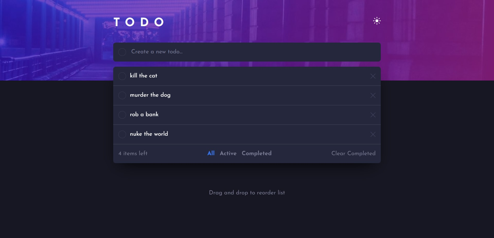
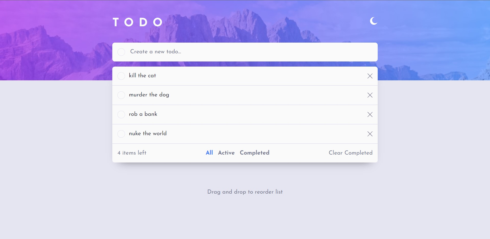

# Frontend Mentor - Todo app solution

This is a solution to the [Todo app challenge on Frontend Mentor](https://www.frontendmentor.io/challenges/todo-app-Su1_KokOW). Frontend Mentor challenges help you improve your coding skills by building realistic projects. 

## Table of contents

- [Overview](#overview)
  - [The challenge](#the-challenge)
  - [Screenshot](#screenshot)
  - [Links](#links)
- [My process](#my-process)
  - [Built with](#built-with)
  - [What I learned](#what-i-learned)
  - [Continued development](#continued-development)
  - [Useful resources](#useful-resources)
- [Author](#author)

## Overview

### The challenge

Users should be able to:

- View the optimal layout for the app depending on their device's screen size
- See hover states for all interactive elements on the page
- Add new todos to the list
- Mark todos as complete
- Delete todos from the list
- Filter by all/active/complete todos
- Clear all completed todos
- Toggle light and dark mode
- **Bonus**: Drag and drop to reorder items on the list

### Screenshot

### Links

- Solution URL: [GitHub](https://github.com/8xMohab/todo-app)
- Live Site URL: [GitPages](https://8xMohab.github.io/todo-app)

## My process

### Built with

- [React](https://reactjs.org/) - JS library
- [Tailwind CSS](https://tailwindcss.com/) - CSS framework
- [dnd-kit](https://tailwindcss.com/) - For Drag and drop functionality
- [Vite](https://vitejs.dev/) - JS build tool
- Mobile-first workflow

### What I learned

  - How to add drag and drop functionality 
  - Adding themes to the website using Tailwind
  - Writing a cleaner code when it comes to derivative state

### Continued development

  - Improve Drag and Drop Styles.
  - Using useEffect() to update the local items List whenever it changes instead of doing it manually.

### Useful resources

- [WebDevSimplified](https://www.youtube.com/@WebDevSimplified) - This helped me with derivative state.
- [Cooper Codes](https://www.youtube.com/watch?v=Z8RoA_YSGDQ) - This helped me with adding the drag and drop functionality.
- [DND-kit documentation](https://docs.dndkit.com/) - If you wanna learn more about dnd-kit.

## Author

- Frontend Mentor - [@8xMohab](https://www.frontendmentor.io/profile/8xMohab)
- Twitter - [@8xMohab](https://www.twitter.com/8xMohab)
